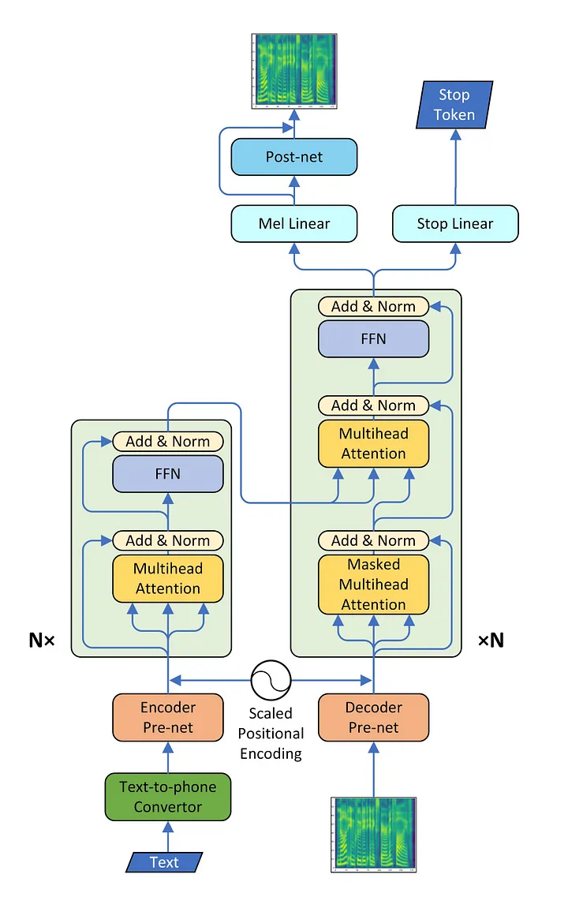

# Transformer-TTS

This repository contains a project aimed at building a **Text-to-speech (TTS) model** using a **transformer-based architecture**.
## Features

- **Text Preprocessing**: Converts text into a sequence of integers representing characters.
- **Audio Preprocessing**: Converts wav files into mel spectrograms and allows reconstruction of the original wav files from the spectrograms.
- **Collate Function**: Implements a custom `textMelCollateFn` for batch processing.
- **Transformer architecture TTS**

  

## Setup and Installation

1. Clone the repository:
   ```bash
   git clone <repo_url>
   cd <repo_directory>
2. Install required python libraries - pytorch, torchaudio, pandas, tqdm, numpy, matplotlib, sklearn
